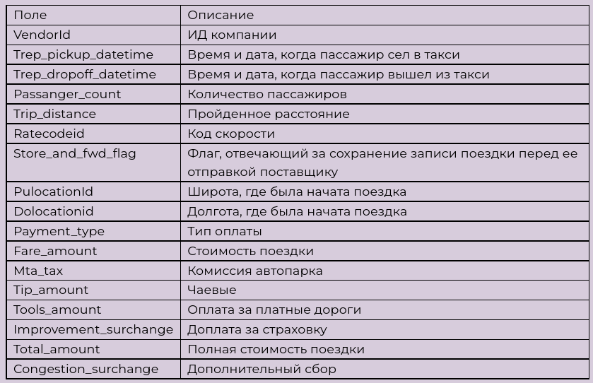
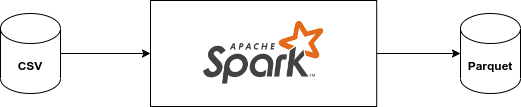
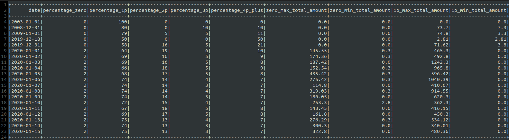
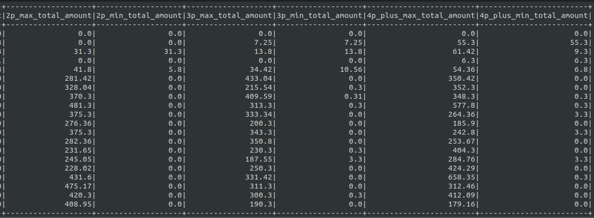
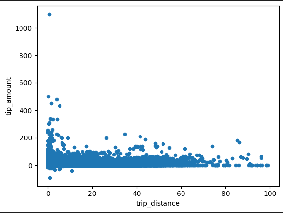

# Taxi service

<div align="center">


</div>

## Description of the project with requirements
There is a table consisting of taxi rides in New York.



It is necessary, using the table of trips for each day, to calculate the percentage of trips by the number of people in the car (without passengers, 1, 2, 3, 4 or more passengers). Also add columns to the previous results with the most expensive and cheapest trip for each group.

The result should be a table (parquet) with columns date, percentage_zero, percentage_1p, percentage_2p, percentage_3p, percentage_4p_plus. Technological stack - sql, scala (one thing).

**Optional**: also conduct analytics and build a graph on the topic “how the distance traveled and the number of passengers affect tips” in any convenient tool.

## Implementation plan

## Technologies used
Technology stack - Apache Spark 3.3.1, Scala 12, Kubernetes (Minikube 1.28.0).

Kubernetes - production-grade container orchestration.

Spark is the ultimate data transformation tool. It can load a csv file and export the result to parquet.

Scala is good because it is a typed language. Many syntax errors will be revealed at the compilation stage.

It was decided to use a regular file system as the file system.

## Schema
A CSV file is placed somewhere in a local folder. This folder is mounted in Kubernetes. From there, Spark takes it and after some transformation puts the parquet files back into this folder.



### Setup and launch

[Article](https://jaceklaskowski.github.io/spark-kubernetes-book/demo/spark-and-local-filesystem-in-minikube/) shows how to set up a Spark application on minikube to access files on a local filesystem.

minikube version: v1.28.0

<details>
  <summary>Example</summary>

```bash
minikube start --driver=kvm2

docker build -f ./docker/Dockerfile -t izair/taxi_service:1.0.5 .
docker push izair/taxi_service:1.0.5

minikube ssh docker pull izair/taxi_service:1.0.5

minikube mount /source_path:/tmp/taxi_service

minikube ssh
ls /tmp/taxi_service
exit

export VOLUME_TYPE=hostPath
export VOLUME_NAME=demo-host-mount
export MOUNT_PATH=/tmp/taxi_service

kubectl proxy

spark-submit \
  --master=k8s://http://127.0.0.1:8001 \
  --deploy-mode cluster \
  --name taxi_service \
  --class org.example.App \
  --conf "spark.kubernetes.container.image=izair/taxi_service:1.0.5" \
  --conf spark.kubernetes.driver.volumes.$VOLUME_TYPE.$VOLUME_NAME.mount.path=$MOUNT_PATH \
  --conf spark.kubernetes.driver.volumes.$VOLUME_TYPE.$VOLUME_NAME.options.path=$MOUNT_PATH \
  --conf spark.kubernetes.executor.volumes.$VOLUME_TYPE.$VOLUME_NAME.mount.path=$MOUNT_PATH \
  --conf spark.kubernetes.executor.volumes.$VOLUME_TYPE.$VOLUME_NAME.options.path=$MOUNT_PATH \
  --conf spark.executor.instances=1 \
  --conf spark.driver.memory=512m \
  --conf spark.executor.memory=512m \
  --conf spark.driver.cores=1 \
  --conf spark.executor.cores=1 \
  --conf spark.kubernetes.namespace=default \
  local:///opt/taxi_service-1.0-jar-with-dependencies.jar

minikube dashboard
```
</details>

## Development results
As a result, a project was created with the following structure:
```bash
.
├── analysis                   # jupyter notebook analysis
├── data                       # data files
├── docker                     # docker files
├── docs                       # documentation
├── images                     # screenshots
├── src                        # source files
└── README.md
```

The data folder contains the head.csv file with the first few lines from [yellow_tripdata_2020-01.csv](https://disk.yandex.ru/d/DKeoopbGH1Ttuw) and the parquet file with the result of its processing.

<details>
  <summary>Processing result example</summary>



</details>


## Findings
Based on the graphs, the following conclusions can be drawn:
1. If you remove the emissions, you can see that the slide gradually descends. This means that the greater the distance of the trip, the less the tip. Perhaps people think that if you pay a lot for a trip, then you can not tip.

    

2. Again, if you remove the emissions, you can see that the more passengers, the less tips they left. Most tips are left by one person.

    


