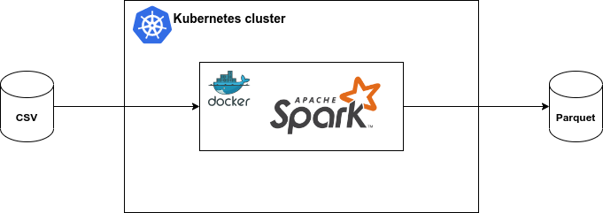

# Clients and accounts

## Description of the project with requirements
There is a table consisting of taxi rides in New York.


It is necessary, using the table of trips for each day, to calculate the percentage of trips by the number of people in the car (without passengers, 1, 2, 3, 4 or more passengers). Also add columns to the previous results with the most expensive and cheapest trip for each group.

The result should be a table (parquet) with columns date, percentage_zero, percentage_1p, percentage_2p, percentage_3p, percentage_4p_plus. Technological stack - sql, scala (one thing).

**Optional**: also conduct analytics and build a graph on the topic “how the distance traveled and the number of passengers affect tips” in any convenient tool.

## Implementation plan
Install Ubuntu 22.04 LTS locally or in a virtual machine.

Install Apache Spark 3.3.1 there.

Implement loading, transforming and unloading data in Apache Spark on Scala.

## Technologies used with rationale
Technology stack - Apache Spark, Scala.

Spark is the ultimate data transformation tool. It can load a csv file and export the result to parquet.

Scala is good because it is a typed language. Many syntax errors will be revealed at the compilation stage.

It was decided to use a regular file system as the file system. There is no point in using a data lake like HDFS because there is no continuous stream of files. The task is to download a single file that contains data for a whole year.

## Schemes/architectures with justification
The architecture is quite simple: the csv file is placed somewhere in a local folder. From there, Spark takes it and after some transformation puts the parquet files back into the local folder. Paths to csv file and parquet file are passed as parameters to this program.



Call example:
```
spark-submit 
    --class org.example.App 
    ./task5_2.12-0.1.0.jar /home/user/yellow_tripdata_2020-01.csv /home/user/results.parquet
```


## Development results
As a result, a project was created with the following structure:
```bash
.
├── analysis                   # Jupyter notebook analysis
├── build                      # Compiled files, jars
├── data                       # Data files
├── docs                       # Documentation files, presentations
├── images                     # Screenshots
├── src                        # Source files
└── README.md
```

The data folder contains a parquet file with the result of processing the file [yellow_tripdata_2020-01.csv](https://disk.yandex.ru/d/DKeoopbGH1Ttuw)

<details>
  <summary>Processing result example</summary>


</details>


## Findings
Based on the graphs, the following conclusions can be drawn:
1. If you remove the emissions, you can see that the slide gradually descends. This means that the greater the distance of the trip, the less the tip. Perhaps people think that if you pay a lot for a trip, then you can not tip.

    

2. Again, if you remove the emissions, you can see that the more passengers, the less tips they left. Most tips are left by one person.

    


