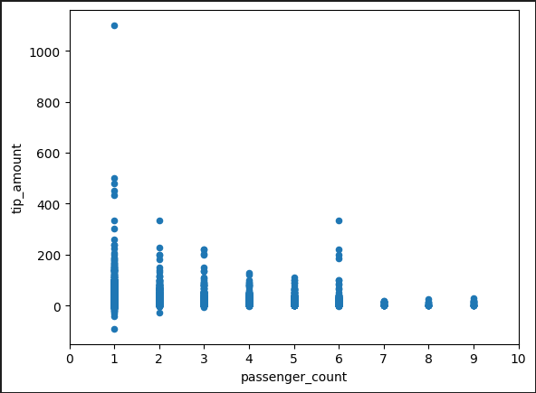

# Клиенты и счета

## Название и общее описание проекта.
Есть таблица, состоящая из поездок такси в Нью-Йорке.


Необходимо сделать некоторую аналитику поездок.

## Цели проекта и описание бизнес-задачи с требованиями
Необходимо, используя таблицу поездок для каждого дня рассчитать процент поездок по количеству человек в машине (без пассажиров, 1, 2, 3, 4 и более пассажиров). Также добавить столбцы к предыдущим результатам с самой дорогой и самой дешевой поездкой для каждой группы.

По итогу должна получиться таблица (parquet) с колонками date, percentage_zero, percentage_1p, percentage_2p, percentage_3p, percentage_4p_plus. Технологический стек – sql, scala (что-то одно).

**Дополнительно**: также провести аналитику и построить график на тему “как пройденное расстояние и количество пассажиров влияет на чаевые” в любом удобном инструменте.

## План реализации
Установить ОС Linux (Ubuntu 22.04.1 LTS) локально или на виртуальной машине.

Установить туда Apache Spark 3.3.1.

В качестве среды разработки выбрана IntelliJ IDEA Community Edition.

Реализовать загрузку, трансформацию и выгрузку данных в Spark на Scala.

## Используемые технологии с обоснованием
Технологический стек – Apache Spark, Scala. 

Spark - самый главный инструмент для трансформации данных. Он может загрузить csv файл и выгрузить результат в parquet. 

Scala хороша тем, что это типизированный язык. Много синтаксических ошибок будет выявлено ещё на этапе компиляции.

В качестве файловой системы принято решение использовать обычную файловую систему. Нет смысла использовать озеро данных типа HDFS, потому что нет какого-то непрерывного потока файлов. Стоит задача загрузки одиного файла, который содержит в себе данные за целый год.

## Схемы/архитектуры с обоснованием
Архитектура довольно простая: csv файл кладется куда-то в локальную папку. Оттуда его берет Spark и после некоторых трансформаций кладет parquet файлы обратно в локальную папку. Пути к csv файлу и parquet файлу передаются как параметры этой программе.

Пример вызова:
```
spark-submit 
    --class org.example.App 
    ./task5_2.12-0.1.0.jar /home/user/yellow_tripdata_2020-01.csv /home/user/results.parquet
```


## Результаты разработки
В результате был создан проект со следующей структурой:
```bash
.
├── analysis                   # Jupyter notebook analysis
├── build                      # Compiled files, jars
├── data                       # Data files
├── docs                       # Documentation files, presentations
├── images                     # Screenshots
├── src                        # Source files
└── README.md
```
В папке data лежит parquet файл с результатом обработки файла [yellow_tripdata_2020-01.csv](https://disk.yandex.ru/d/DKeoopbGH1Ttuw)

## Выводы
На основании графиков можно сделать следующие выводы:
1. Если убрать выбросы, то видно, что постепенно горка опускается. Значит чем больше дистанция поездки, тем меньше чаевые. Возможно, люди думают, что если много заплатить за поездку, то чаевых можно не оставлять.

2. Опять же, если убрать выбросы, то видно, что чем больше пассажиров, тем меньше чаевых они оставляли. Больше всего оставляет один человек.



